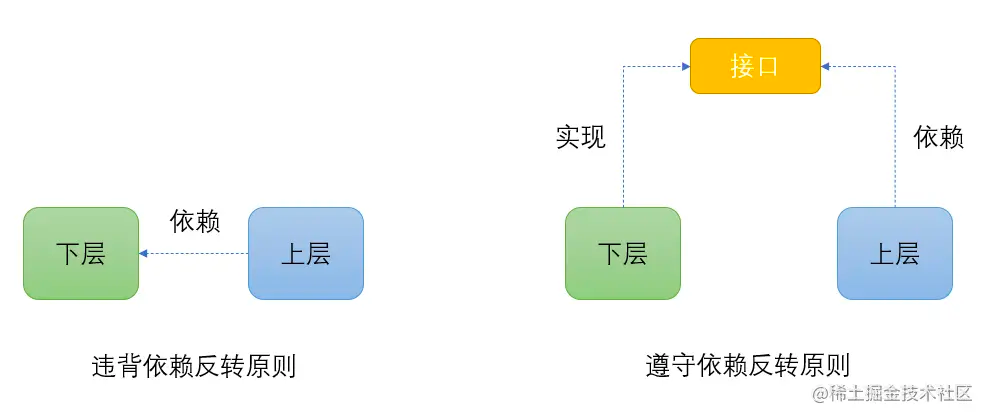
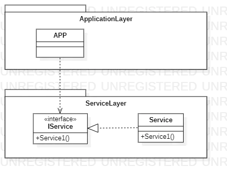
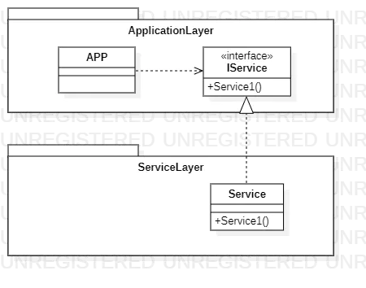

## 依赖反转原则DIP（Dependency Inversion Principle）

```
High level modules should not depend upon low level modules. Both should depend upon abstractions.
Abstractions should not depend upon details. Details should depend upon abstractions。
```

依赖反转原则是指一种特定的解耦（传统的依赖关系建立在高层模块，而具体的策略设置则应用在低层模块上）形式， 使得高层模块不依赖于低层模块的实现细节，依赖关系被颠倒（反转），从而使得低层模块依赖于高层模块的需求抽象。(
这句话说起来有点抽象，下面会详细解释怎么理解`反转`)

该原则规定：

- 高层模块不应该依赖于低层模块，两者都应该依赖于抽象接口。



- 抽象接口不应该依赖于具体实现。而具体实现则应该依赖于抽象接口。(即面向接口编程)

### 如何依赖反转原则中的`反转`

传统上按照软件划分层或者模块，通常都是将相同语义的元素放在一起，因此接口与其实现类应该处于同一层模块之中。


这看似好像没有问题，但是软件的高层模块可能会发生变化。当高层模块发生了改变，那它依赖的低层对象所提供的服务也很可能要发生变化，因为高层要完成新的业务，低层要负责提供对应的服务。
那么问题来了，谁来约定这个接口提供什么样的服务？按照前面的逻辑，接口和实现放在低层中，那应该由低层提供，可是低层开发人员并不负责高层的应用逻辑。低层只负责响应高层的需求，去按照需求提供实现服务。
但现在接口放在低层维护，就应该由低层的开发人员负责体现需求的接口的变更。这样会发现这样的情况，负责高层实现的开发人员，他们拥有需求，但无法定义描述需求的接口；负责低层的开发人员，他们不管需求，只应提供具体实现，却要维护和应用需求有关的接口。

因此，为了解决这样的矛盾，人们提出将本应放在低层的接口放在高层，低层的实现依赖高层提供的接口，去实现相应的服务。这才是依赖反转原则DIP中反转的真正含义所在。



### 场景理解示例

设备有很多类型，每种设备都有登录和采集两个方法，通过DeviceService这个服务去启动设备的采集，最开始我们只有MML和TL2这两种类型的设备，那么来看看我们的设计代码。 代码示例：

```
//MML类型的设备
class DeviceMML {
    public void Login() {
        System.out.println("MML设备登录");
    }

    public boolean Spider() {
        System.out.println("MML设备采集");
        return true;
    }
}

//TL2类型设备
class DeviceTL2 {
    public void Login() {
        System.out.println("TL2设备登录");
    }

    public boolean Spider() {
        System.out.println("TL2设备采集");
        return true;
    }
}

//设备采集的服务
class DeviceService {
    private DeviceMML MML = null;
    private DeviceTL2 TL2 = null;
    private String type = "";

    //构造函数里面通过类型来判断是哪种类型的设备
    public DeviceService(String type) {
        this.type = type;
        if (Objects.equals(type, "0")) {
            MML = new DeviceMML();
        } else if (Objects.equals(type, "1")) {
            TL2 = new DeviceTL2();
        }
    }

    public void Login() {
        if (Objects.equals(type, "0")) {
            MML.Login();
        } else if (Objects.equals(type, "1")) {
            TL2.Login();
        }
    }

    public boolean Spider() {
        if (Objects.equals(type, "0")) {
            return MML.Spider();
        }
        if (Objects.equals(type, "1")) {
            return TL2.Spider();
        }
        return true;
    }
}
```

在Main函数里面调用

```
public class Program{
    public static void main(String[] args) {
        DeviceService oSpider = new DeviceService("1");
        oSpider.Login();
        oSpider.Spider();
    }
}
```

上述代码经过开发、调试、部署、上线。可以正常运行，一切都OK。 后来公司又来一种新的设备TELNET类型设备。于是程序猿们又有得忙了，加班，赶进度！于是代码变成了这样：

```
//TELNET类型设备
class DeviceTELNET {
    public void Login() {
        System.out.println("TELNET设备登录");
    }

    public boolean Spider() {
        System.out.println("TELNET设备采集");
        return true;
    }
}

//设备采集的服务
class DeviceService {
    private DeviceMML MML = null;
    private DeviceTL2 TL2 = null;
    private DeviceTELNET TELNET = null;
    private String type = "";

    //构造函数里面通过类型来判断是哪种类型的设备
    public DeviceService(String type) {
        this.type = type;
        if (Objects.equals(type, "0")) {
            MML = new DeviceMML();
        } else if (Objects.equals(type, "1")) {
            TL2 = new DeviceTL2();
        }else if (Objects.equals(type, "2")){
            TELNET = new DeviceTELNET();
        }
    }

    public void Login() {
        if (Objects.equals(type, "0")) {
            MML.Login();
        } else if (Objects.equals(type, "1")) {
            TL2.Login();
        }else if (Objects.equals(type, "2")) {
            TELNET.Login();
        }
    }

    public boolean Spider() {
        if (Objects.equals(type, "0")) {
            return MML.Spider();
        }
        if (Objects.equals(type, "1")) {
            return TL2.Spider();
        }
        if (Objects.equals(type, "2")) {
            return TELNET.Spider();
        }
        return true;
    }
}
```

比如我们想启动TELNET类型设备的采集，这样调用可以实现：

```
public class Program{
    public static void main(String[] args) {
        DeviceService oSpider = new DeviceService("2");
        oSpider.Login();
        oSpider.Spider();
    }
}
```

花了九年二虎之力，总算是可以实现了。可是又过了段时间，又有新的设备类型呢？是不是又要加班，又要改。 这样下去，感觉这就是一个无底洞，再加上时间越久，项目所经历的开发人员越容易发生变化，这个时候再改，那维护的成本堪比开发一个新的项目。
并且，随着设备类型的增多，代码里面充斥着大量的if...else，这样的烂代码简直让人无法直视。

基于这种情况，如果我们当初设计这个系统的时候考虑了依赖倒置，那么效果可能截然不同。我们来看看依赖倒置如何解决以上问题的呢？

```
//定义一个统一接口用于依赖
public interface IDevice {
    void Login();

    boolean Spider();
}


//MML类型的设备
class DeviceMML implements IDevice {
    public void Login() {
        System.out.println("MML设备登录");
    }

    public boolean Spider() {
        System.out.println("MML设备采集");
        return true;
    }
}

//TL2类型设备
class DeviceTL2 implements IDevice {
    public void Login() {
        System.out.println("TL2设备登录");
    }

    public boolean Spider() {
        System.out.println("TL2设备采集");
        return true;
    }
}

//设备采集的服务
class DeviceService {
    private IDevice m_device;

    public DeviceService(IDevice oDevice) {
        m_device = oDevice;
    }

    public void Login() {
        m_device.Login();
    }

    public boolean Spider() {
        return m_device.Spider();
    }
}

```

Main中调用:

```
 public static void main(String[] args) {
        DeviceService oSpider = new DeviceService(new DeviceTL2());
        oSpider.Login();
        oSpider.Spider();
 }
```

代码说明：

**上述解决方案中，我们定义了一个IDevice接口，用于上层服务的依赖。
也就是说，上层服务（这里指DeviceService）仅仅依赖IDevice接口，对于具体的实现类我们是不管的，只要接口的行为不发生变化，增加新的设备类型后，上层服务不用做任何的修改。
这样设计降低了层与层之间的耦合，能很好地适应需求的变化，大大提高了代码的可维护性。**